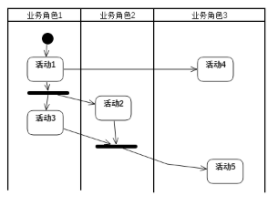



**本科毕业论文（设计）**

**需求规格说明书**

|**学 生 姓 名**|**黄文涛**|
| - | :-: |
|**学号**|**2022131085**|
|**专业**|**人工智能**|
|**年级班级**|**2022级3班**|
|**指导教师**|**刘妍君（讲师）**|
|**所在学院**|**人工智能学院**|
|**提交日期**|**2025年12月31日**|

2025 年 12 月

成都信息工程大学 人工智能学院

II

**目录**

[1	引言	3](#_toc20263109)

[1.1	编制目的	3](#_toc20263110)

[1.2	范围	3](#_toc20263111)

[1.3	预期的读者和阅读建议	3](#_toc20263112)

[1.4	术语和缩略语	3](#_toc20263113)

[1.5	文档约定	3](#_toc20263114)

[1.6	参考文件	3](#_toc20263115)

[2	项目概述	3](#_toc20263116)

[2.1	目标	3](#_toc20263117)

[2.2	范围	4](#_toc20263118)

[2.3	用户的特点	4](#_toc20263119)

[2.4	假定条件和约束限制	4](#_toc20263120)

[2.5	运行环境	4](#_toc20263121)

[2.5.1	硬件环境	4](#_toc20263122)

[2.5.2	软件环境	4](#_toc20263123)

[3	业务分析	4](#_toc20263124)

[3.1	组织机构结构分析	4](#_toc20263125)

[3.2	业务流程分析	5](#_toc20263126)

[4	用户需求	5](#_toc20263127)

[4.1	总体功能	5](#_toc20263128)

[4.1.1	系统功能框图	5](#_toc20263129)

[4.1.2	总体功能分类描述	5](#_toc20263130)

[4.2	子系统1	6](#_toc20263131)

[4.2.1	业务流程	6](#_toc20263132)

[4.2.2	功能描述	6](#_toc20263133)

[4.3	子系统2	7](#_toc20263134)

[4.4	子系统n	7](#_toc20263135)

[5	数据描述	7](#_toc20263136)

[5.1	数据流程图	7](#_toc20263137)

[5.2	数据字典	7](#_toc20263138)

[6	功能需求	7](#_toc20263139)

[6.1	功能需求总述	7](#_toc20263140)

[6.1.1	功能需求总表	7](#_toc20263141)

[6.1.2	角色、权限需求	8](#_toc20263142)

[6.2	功能需求1名称	8](#_toc20263143)

[6.2.1	子功能1 名称	8](#_toc20263144)

[6.3	功能需求N名称	9](#_toc20263145)

[6.3.1	子功能N名称	9](#_toc20263146)

[7	功能需求	9](#_toc20263147)

[7.1	系统角色分析	9](#_toc20263148)

[7.2	系统用例分析	10](#_toc20263149)

[7.2.1	系统用例	10](#_toc20263150)

[7.2.2	用例1	10](#_toc20263151)

[7.2.3	用例2	11](#_toc20263152)

[7.2.4	用例N	11](#_toc20263153)

[7.3	系统用例描述	11](#_toc20263154)

[7.3.1	用例描述概述	11](#_toc20263155)

[7.3.2	用例1	12](#_toc20263156)

[7.3.3	用例2	14](#_toc20263157)

[7.3.4	用例N	15](#_toc20263158)

[7.4	系统概念模型	15](#_toc20263159)

[7.4.1	视图模型	15](#_toc20263160)

[7.4.2	逻辑模型	15](#_toc20263161)

[7.4.3	实体模型	16](#_toc20263162)

[8	非功能需求	16](#_toc20263163)

[8.1	性能需求	16](#_toc20263164)

[8.2	安全保密需求	17](#_toc20263165)

[8.3	扩展性需求	17](#_toc20263166)

[8.4	稳定性需求	17](#_toc20263167)

[8.5	部署需求	17](#_toc20263168)

[9	界面要求	17](#_toc20263169)

[9.1	图形要求	17](#_toc20263170)

[9.2	报表格式	18](#_toc20263171)

[9.3	其他	18](#_toc20263172)

1. # **引言**
   1. ## **编制目的**
描述文档编写的内容及目的和作用。
1. ## **范围**
本节描述以下内容：

1、用一个名字标识被生产的软件产品。比如：XXX数据库系统，报表生成程序等等；

2、说明软件产品将干什么，如果需要的话，还要说明软件产品不干什么；

3、描述所说明的软件的应用，应当：

a）尽可能精确地描述所有相关的利益、目的、以及最终目标；

b）如果有一个较高层次的说明存在，则应该使其和高层次说明中的类似的陈述相一致（例如，系统的需求规格说明）。

4、指出软件产品在人工智能领域的具体应用范围，例如是图像识别、自然语言处理还是其他具体的人工智能应用方向。
1. ## **预期的读者和阅读建议**
列举软件需求规格说明书所针对的不同读者，例如开发人员、项目经理、用户、测试人员或文档的编写人员。提出最适合于每一类型读者阅读文档的建议。
1. ## **术语和缩略语**
表11 术语和缩略语

|**术语、缩略语**|**解      释**|
| :-: | :-: |
|||
|||
1. ## **文档约定**
相关约定描述
1. ## **参考文件**
列举编写功能需求说明书时所参考的资料或其它资源。这可能包括用户界面风格指导、合同、标准、系统需求规格说明、使用实例文档，或相关产品的软件需求说明或用户手册。
1. # **项目概述**
   1. ## **目标**
叙述该项软件开发的意图、应用目标以及其他应向读者说明的有关该软件开发的背景材料。解释被开发软件与其他有关软件之间的关系。
1. ## **范围**
说明此项目、软件的涵盖的需求范围和简单的功能描述。
1. ## **用户的特点**
列出本软件的最终用户的特点，充分说明操作人员、维护人员的教育水平和技术专长，以及本软件的预期使用频度。可根据实际情况做增减。
1. ## **假定条件和约束限制**
完成本文所描述需求的假定软、硬件设施、人为因素等条件和约束。例如：对软件使用者素质的要求、对硬件环境的要求。
1. ## **运行环境**
说明本产品的运行环境（包括硬件环境和软件环境）的规定。根据不同类型、不同规模的项目，项目组可以对以下内容做增减。
1. ### **硬件环境**
（1）描述本软件运行对服务器、客户端的硬件要求：

① 服务器：主要描述设备名称、设备型号、设备数量、处理器型号及内存容量；

② 客户端：主要描述客户端的内存、处理器、硬盘容量。

（2）描述本软件运行所使用的外围设备，主要包括：

① 外存储设备的容量、媒体及其存储格式、设备型号和数量等；

② 输入/输出设备的型号和数量等；

③ 数据通信设备的型号和数量等；

④ 其它专用硬件。
1. ### **软件环境**
描述本软件运行所使用的计算机软件及版本，包括：

1. 区块链平台；
1. 操作系统；
1. 数据库系统；
1. 开发平台及工具；
1. 相关协议；
1. 其他软件。

   分析客户的业务需求，画出与系统相关的组织机构图等。
1. # **区块链平台的搭建**
   1. ## **区块链平台简介**

1. ## **区块链平台搭建**

1. # **功能需求**
对用户需求的整理和描述，本说明书按着自顶向下、逐层细化的原则展开。每层用图表达工作流程，用表格给出了文字描述。（本章采用业务建模的方式为后续用例分析提供支撑，仅面向功能的需求规格说明可以放弃本章内容。）
1. ## **总体功能**
   1. ### **系统功能框图**
`   `系统总体功能框图见图4-1。系统总体功能的划分说明。所完成的功能见表4-1。

**图4-1 系统总体功能框图**
1. ### **总体功能分类描述**
系统总体功能分类描述见表4-1。针对每个功能模块，说明其在人工智能应用中的目标，如数据处理模块实现数据清洗、标注、增强等功能，以提高数据质量用于模型训练；模型训练模块描述采用的算法、训练策略和预期达到的性能指标等。

**表4-1 总体功能分类**

|类别/标识符|目标描述|
| :-: | :-: |
|` `子模块1（SYS1）|
`　`完成……。最终达到……。

`　`细节见4.2节
|
|子模块2（SYS2）|`　`完成……。最终达到……。  细节见4.3节|
|` `……|
`　`……

`  `细节见4. 节
|
|子模块n（SYSn）|
`  `完成……。最终达到……。

`  `细节见4.n节
|
1. ## **子模块1**
   1. ### **业务流程**
采用活动图来表述相应的业务处理流程。流程中包含人工智能算法模型相关业务流程，如模型训练流程（包括数据准备、参数设置、训练迭代、模型评估与调整等活动），反映人工智能系统的运行逻辑。

**图4-  业务子模块1流程**
1. ### **功能描述**
根据子模块1 的活动图，从人工智能角度详细描述业务功能需求，如数据预处理功能，模型预测功能等，见表4-1。

**表4-1  业务子模块1需求描述**

|
功能名称

标识符
|`　`子模块1（SYS1）|||
| :-: | :- | :- | :- |
|
功

能

描

述
|名称、标识符|执行角色|描述|
||
业务功能1

（SYS1 -01）
|业务角色1||
||
业务功能2

（SYS1 -02）
|业务角色2||
||
业务功能3

（SYS1 -03）
|业务角色1||
||
业务功能4

（SYS1 -04）
|业务角色3||
||
业务功能5

（SYS1 -05）
|业务角色3||

1. ## **子模块2**
类似子模块1描述。
1. ## **子模块n**
类似子系统1描述。

1. # **非功能需求**
对软件的非功能需求的描述，应包括性能、安全性、可扩展性、稳定性等方面的需求界定。
1. ## **性能需求**
说明软件数据处理能力和时间特性的需求。

（1）数据处理能力可能包括：支持的终端数、支持并行操作的用户数、处理的文件和记录数、表和文件的大小。

（2）时间特性可能包括：响应时间、更新处理时间、数据的转换和传送时间、运行时间、模型训练时间、模型预测响应时间、系统吞吐量等。
1. ## **安全保密需求**
指明本软件应具有的安全及保密功能，包括：

（1）防止非授权用户登录；

（2）防止非法数据侵入；

（3）密码存储及乱码传输。

还可以从主机系统（操作系统）的安全、网络与通信安全、应用系统安全、防火墙、数据安全等方面进行说明。
1. ## **扩展性需求**
一方面要说明本系统能够进行功能扩展，可灵活地增、减功能模块或者是构件。另一方面说明可预见的未来一段时间内的应用需求及本系统对其的支持。

还应说明用户对系统提出的可扩展性需求。

本章节可根据实际情况做增减。
1. ## **稳定性需求**
说明软件在一个运行周期内、在一定的压力条件下，软件的出错机率。模型在连续运行一定时间后不会出现性能下降或异常行为等。

本章节可根据实际情况做增减
1. ## **部署需求**
说明系统的部署架构，如采用单机部署、分布式部署还是混合部署方式；对于分布式部署，说明节点之间的通信方式、任务分配策略和数据同步机制；明确系统对部署环境的依赖关系，如所需的云计算平台（如阿里云等）、容器化技术（如Docker）的支持。

本章节可根据实际情况做增减。

如果是基于用例的需求描述，应该使用部署图对逻辑模型中重要的控制类的部署进行描述。

1. # **数据库描述**
   1. ## **数据库E-R图**

1. ## **数据表**
列出所有作为控制或参考用的基础数据以及业务处理过程中产生的数据（包括在常规运行中或联机操作中要改变的数据），参考数据库设计报告的数据字典部分，包括数据项和数据结构。

表61 数据表

|**序号**|**数据**|**数据描述**|**数据所属部门**|
| - | :-: | :-: | :-: |
|||||
|||||

