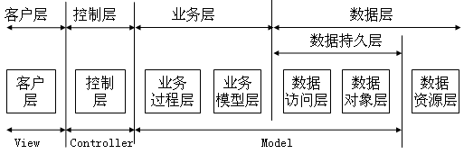
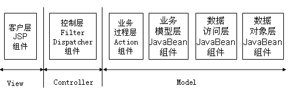
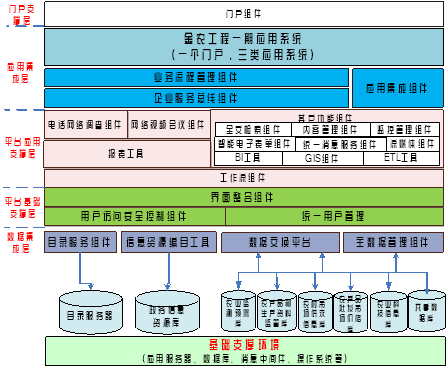
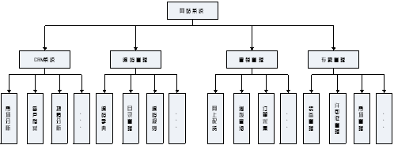
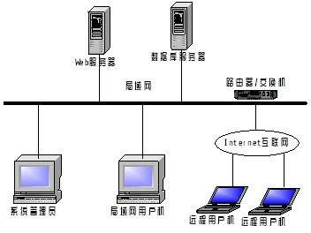
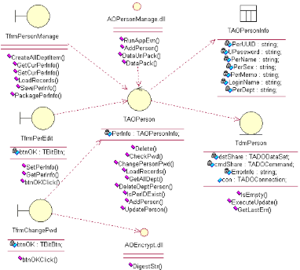
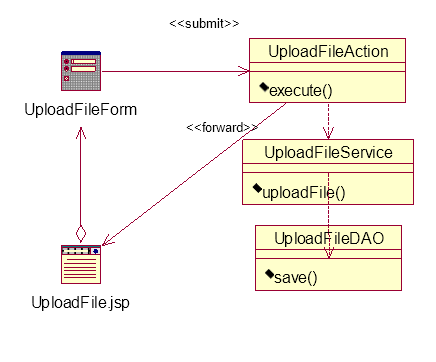

`	`测试报告

**本科毕业论文（设计）**

**概要设计说明书**

|**学 生 姓 名**||
| - | :-: |
|**学号**||
|**专业**|**区块链工程**|
|**年级班级**|**2020级X班**|
|**指导教师**|**（**选择一项。**）**|
|**所在学院**|**区块链产业学院**|
|**提交日期**|单击此处输入日期。|

2024 年 3 月

成都信息工程大学 区块链产业学院

\- 1 -

**目录**

[1	引言	- 1 -](#_toc20263087)

[1.1	编写目的	- 1 -](#_toc20263088)

[1.2	背景	- 1 -](#_toc20263089)

[1.3	术语	- 1 -](#_toc20263090)

[1.4	参考资料	- 1 -](#_toc20263091)

[2	总体设计	- 1 -](#_toc20263092)

[2.1	系统体系结构	- 1 -](#_toc20263093)

[2.2	系统总体功能结构	- 2 -](#_toc20263094)

[2.3	运行环境	- 3 -](#_toc20263095)

[2.3.1	硬件环境	- 4 -](#_toc20263096)

[2.3.2	软件环境	- 4 -](#_toc20263097)

[2.4	系统的关键技术	- 4 -](#_toc20263098)

[3	功能模块设计说明	- 4 -](#_toc20263099)

[3.1	功能模块列表	- 5 -](#_toc20263100)

[3.2	功能模块1名称	- 5 -](#_toc20263101)

[3.2.1	模块编号和功能描述	- 5 -](#_toc20263102)

[3.2.2	操作者	- 5 -](#_toc20263103)

[3.2.3	与本模块相关的码表和表	- 5 -](#_toc20263104)

[3.2.4	界面设计与说明	- 6 -](#_toc20263105)

[3.2.5	输入信息	- 6 -](#_toc20263106)

[3.2.6	输出信息	- 6 -](#_toc20263107)

[3.2.7	算法	- 6 -](#_toc20263108)

[3.2.8	对象时序图	- 6 -](#_toc20263109)

[3.2.9	模块各对象的封装	- 7 -](#_toc20263110)

[3.2.10	类设计	- 8 -](#_toc20263111)

[3.3	功能模块2名称	- 9 -](#_toc20263112)

[4	视图设计	- 9 -](#_toc20263113)

[4.1	界面风格设计	- 10 -](#_toc20263114)

[4.2	主界面设计	- 10 -](#_toc20263115)

[5	内部接口设计	- 10 -](#_toc20263116)

[5.1	接口1	- 10 -](#_toc20263117)

[5.2	接口2	- 11 -](#_toc20263118)

[6	系统出错处理设计	- 11 -](#_toc20263119)

[6.1	出错信息	- 11 -](#_toc20263120)

[6.2	补救措施	- 11 -](#_toc20263121)

毕业设计文档	概要设计说明书
1. # **引言**
   1. ## **编写目的**
说明编写这份概要设计说明书的目的，指出预期读者。
1. ## **背景**
描述系统产生的背景，包括：

1) 需开发的软件系统的名称，和英文缩写（可选），项目编号（可选）；
1) 列出此项目的任务提出者、开发者
1) 软件系统应用范围、用户。
   1. ## **术语**
列出本文件中用到的专门术语、术语定义、外文首字母组词的原词组。
1. ## **参考资料**
本节列出用得着的参考资料，如：

1) 本项目经核准的计划任务书或合同、上级机关的批文；
1) 属于本项目的其他已发表的文件；
1) 本文件中各处引用的文件、资料、包括所要用到的软件开发标准。
1) 行业标准和规范。
1) 列出这些文件资料的标题、文件编号、发表日期和出版单位。
1. # **总体设计**
   1. ## **系统体系结构**
体系结构决定领域问题结构设计的走向，是系统设计的蓝图。编制并描述系统的体系结构图，并说明系统的运行原理。

**水平示例：**

本系统分层结构，见图2-1。

图2-1 系统分层结构

根据系统的分层结构，该系统选择符合J2EE规范的Tomcat中间件。客户层选用JSP组件；业务流程层选用Action组件；业务模型层、数据访问层和实体对象层选用JavaBean组件；控制层选用FilterDispatcher 组件。见图3-2。

图2-2各层组件图

**垂直示例：**

||
| :-: |
|
图23 系统体系结构图

|
1. ## **系统总体功能结构**
用一览表及图的形式说明本系统的结构（构件、各层模块等）的划分。

**示例**：

||
| :-: |

图22 系统功能结构图
1. ## **运行环境**
说明本产品的运行环境（包括硬件环境和软件环境）的规定。根据不同类型、不同规模的项目，项目组可以对以下内容做增减。

运行环境设计包括网络结构，硬件、软件环境。

本系统的网络拓扑图如图3- 。

图3-2网络拓扑图

本系统提供本地和远程两种访问系统的用户机，及局域网用户机和远程用户机。

数据库服务器：

- IP：59.73.87.105
- 网关：59.73.87.254
- 端口：3306
- 用户名：root
- 密码：123456

Web服务器：

- IP：59.73.87.106
- 网关：59.73.87.254
- 端口：8080
- 域名：http://www.\*\*\*。
  1. ### **硬件环境**
1. 描述本软件运行对服务器、客户端的硬件要求：

服务器：主要描述设备名称、设备型号、设备数量、处理器型号及内存容量；

客户端：主要描述客户端的内存、处理器、硬盘容量。

1. 描述本软件运行所使用的外围设备，主要包括：

外存储设备的容量、媒体及其存储格式、设备型号和数量等；

输入/输出设备的型号和数量等；

数据通信设备的型号和数量等；

其它专用硬件。
1. ### **软件环境**
描述本软件运行所使用的计算机软件及版本，包括：

1) 操作系统；
1) 数据库系统；
1) 开发平台及工具；
1) 通信协议；
1) 其他软件。
   1. ## **系统的关键技术**
说明系统中使用到的关键技术及对关键技术的测评结果
1. # **功能模块设计说明**

1. ## **功能模块列表**
表31 功能模块列表

|
**模块**

**编号**
|
**模块**

**名称**
|
**对应需求**

**功能编号**
|
**所对应**

**需求功能**
|
**实现**

**优先级**
|
| :-: | :-: | :-: | :-: | :-: |
||||||
|DS\_YXGL01|订单采集|SRS\_YXGL02.01|订单采集|高|
||||||
||||||
说明：

1. 模块编号，建议采用设计的英文缩写\_模块名称缩写（可以是中文缩写也可以是英文缩写）+序列号的方式；

例如：DS\_YXGL01

1. 如果模块是来自复用，需说明模块是否复用。
   1. ## **功能模块1名称**
如该功能模块下有子功能模块，请采用层级结构进一步说明。功能模块的描述，可以根据项目实际情况做裁剪和增补。一般需求明确如下内容：
1. ### **模块编号和功能描述**
给出本功能模块的编号，描述本模块的主要功能。
1. ### **操作者**
说明使用此模块的相关角色。
1. ### **与本模块相关的码表和表**
说明与本模块相关的数据库码表及表格。其中，作用指在本子系统中对该表的操作为：input（输入）、output（输出）、update（更新）等。格式可如下：

表32 模块功能表

|**名称**|**中文注释**|**类型**|**作用**||
| :-: | :-: | :-: | :-: | :- |
|||**码表**|**表**||
||||||
||||||
||||||
1. ### **界面设计与说明**
界面的详细设计，如有子页面需求，应进行子页面的设计。对界面的相关元素应做详细说明。
1. ### **输入信息**
解释各输入数据类型，给出对每一个输入参数的特性，包括名称、标识、数据的类型和格式、数据值的有效范围、输入的方式。 数量和频度、输入介质、输入数据的来源和安全保密条件, 输入时代码表与基本表的情况,使用的特殊输入设备情况等等。
1. ### **输出信息**
解释各输出数据类型，并逐项说明其媒体、格式、数值范围、精度等。对输出中有明确要求输出量必须进行解释并举例，包括对正常结果输出、状态输出及异常输出，图形或显示报告的描述。
1. ### **算法**
包括计算公式与说明、某些设定的或必然的逻辑关系。对于函数，要着重说明。
1. ### **对象时序图**
本节内容为用例驱动的面向对象设计必选的内容。

依据MVC架构，对模块1在需求规格中对应的用例，按架构提供的客户层、控制层、业务层、数据层排列对应的参与者、边界类、控制类、实体类对应的对象，根据需求规格中用例详细描述，设计基于架构的对象之间的协作关系，并用对象时序图表示出来。

示例：上传文件

图3- 上传文件的对象时序图
1. ### **模块各对象的封装**
示例：上传文件模块对象封装见表3- 。

表3- 上传文件模块对象封装

|模块名称|` `程序文件|`  `功能说明|`    `封装方法|
| - | - | - | - |
|
上传文件

界面
|UploadFile.jsp|
- 一次可“添加”若干上传文件；

- 每个文件“填写”对应标题

- “浏览”选择上传文件的路径；

- 允许单个文件容量5M，一次最大上传容量200M；

- 指示上传文件状态
|
addComponent()

|
|
上传文件

业务过程
|UploadFileAction.java|
- 响应HTTP请求，获取前台表单数据

- 保存文件信息

- 导航到UploadFile.jsp
|
execute（）

|
|
上传文件

业务方法
|UploadFileService.java|- 实现保存文件的方法|uploadFile（）|
|
上传文件

持久化模块
|
UploadFileDAO.java

|- 对上传文件进行持久化|save()|

1. ### **类设计**
给出本模块的类设计，包括类图和类说明。

对于J2EE应用，可以分控制类（例如用到的Servlet）、实体类（例如DAO）、业务类（例如处理业务的Handler）、视图类（例如JSP）、接口类（例如供别的模块调用的API）、工具类（例如对字符串进行处理的StringUtil）进行描述。JSP可以放在视图类中进行描述，描述包括使用到的重要的JavaScript。

1. #### **类图**
示例：

||
| :-: |

图31 类图

或者：示例：

模块web类关系图，见图3-。

图3- 上传文件模块类关系图

1. #### **类说明**
描述类图中主要类的功能和方法。

示例：

（一）TAOPerson类说明：

1. 功能：
1. 主要方法：
   1. ## **功能模块2名称**
如系统有多个功能模块组成，则对其它模块继续进行介绍。
1. # **视图设计**
视图设计部分满足人机交互要求，也称人机接口设计。该部分设计是将上述按功能模块结构设计中各模块的视图对象进行组合，按操作者的需求安排界面。

界面的整合可以按功能、按角色或按流程，本设计是按操作流程组合人机操作界面。
1. ## **界面风格设计**

1. ## **主界面设计**

1. # **内部接口设计**
本系统内的各功能模块之间的接口。对每个模块提供的接口进行说明，需说明接口的使用者/调用者、接口的目的、内容、数据格式、读写方式、约束等。

表41 构件接口列表

|**模块名称**|**接口编号**|**接口名称**|**接口类型**|**说明**|
| :-: | :-: | :-: | :-: | :-: |
|模块1|||内部||
||||外部||
|…|||||
||||||
1. ## **接口1**
1. 接口属性设计

表42 ××接口说明

|**接口编号**||
| - | - |
|**接口名称**||
|**接口说明**||
|**数据来源**||
|**调用者**||
|**输入**||
|**输出**||
|**处理流程**||
1. 接口处理流程图

配合上面的“处理流程”；

1. 类设计

表43 ××类

|**类名称**||
| - | - |
|**分类**||
|**描述**||
|**使用到的其他类**||
|**属性及方法描述**||
|**使用/交互**||
|**其他** ||
1. ## **接口2**

1. # **系统出错处理设计**
   1. ## **出错信息**
用一览表的方式说明每种可能的出错或故障情况出现时，系统输出信息的形式、含意及处理方法。

|序号|出错或故障情况|系统输出信息及处理|
| - | - | - |
|1|如果用户名和密码为空|客户端调用进行处理，系统弹出错误的提示，要求用户重新输入。|
|2|在输入毕设信息为空|客户端调用进行处理，系统弹出错误的提示，要求用户重新输入。|
|3|
在插入的过程中，SQL语句有可能抛出异常

例如主键重复，不能为空的语句没有输入数值
|系统会抛出异常信息，并给出提示信息，只要用户返回上一个页面，重新输入正确的数据，进行同样的操作即可得到正确的结果。|
|4|用户修改个人密码，输入的原密码与以前的不相同，或新密码与确认密码不相同时|调用语句提示用户重新输入|
1. ## **补救措施**
系统通过不同的界面提示信息，提示用户更正操作，让后台屏蔽异常或抛出异常状态，使得管理员在调试的过程中发现问题。

\- 7 -

